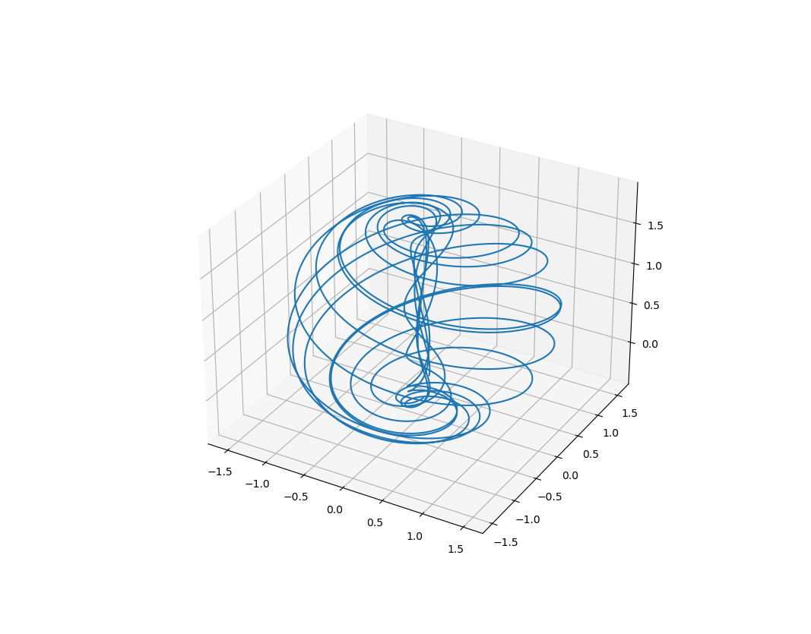
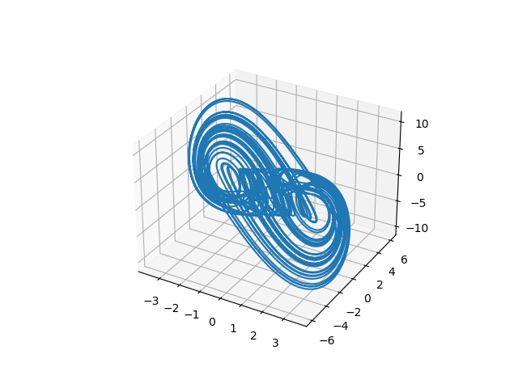

# Implementing Chaos theory concepts in Python and/or Julia

## Attractors

Some reference links:

	- https://sequelaencollection.home.blog/3d-chaotic-attractors/

	- https://www.cedrick.ai/posts/attractors.html

Some of the results:

- Aizawa attractor:

	

- Arneodo attractor:

	
